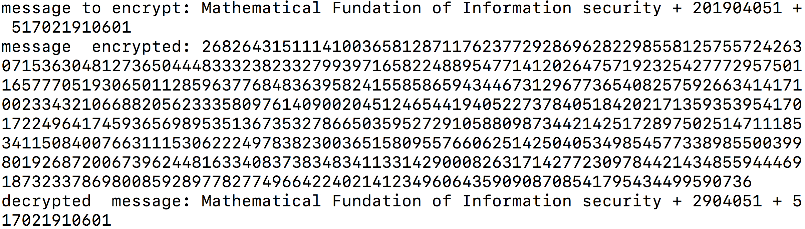

作业要求
========

编程实现RSA密码系统：

1.  随机产生大素数p, q（位长14-bit）以及p * q=n.

2.  随机产生公私钥对(e, n)及d

3.  对消息"m = Mathematical Fundation of Information security +
    201904051 + 学号"进行数字化

4.  对消息m加密和解密

文件说明
========

我一共使用Python语言编写了7个文件，其相关功能说明如下：

-   **Eratoshenes.py** -
    使用平凡除法/厄拉托塞斯筛法计算小于10000的1229个素数，计算结果放入Prime.py文件中以供后续使用。

-   **fast\_power.py** -
    模重复平方计算法，用以快速计算形如$b^n\ (mod\ m)$的算式。

-   **FermatTest.py** -
    费马素性检验，用以检验随机生成的奇数是否是一个伪素数。

-   **Prime.py** - 保存了小于10000的1229个素数。

-   **RandBigPrime.py** - 随机产生大素数

-   **rsa.py** - 主程序，完成消息输入，参数计算，加密解密的功能。

-   **str\_rsa.py** -
    完成字符串的十六进制ASCII表示与整数之间格式的转换。

运行
====

程序依赖
--------

-   需要Python3.x版本，Python2.x版本无法正常运行。

-   需要且只需要Python的一个标准库random库用以生成随机整数。

样例结果
--------

总体思路
========

产生大素数的思路
----------------

首先用系统随机函数产生一个随机整数，若为偶数则加一成为奇数，然后使用10000内的素数试除，确定不存在小于10000的因子后进行费马素性检验，在多轮费马素性检验且成功之后可以假设该伪素数即为素数。

加密思路
--------

由于每个字符可以转换为其对应的ascii码表示，所以将用户输入的一个字符串作为整体看作是一个大整数。

具体实现步骤
============

从程序功能从基本到全局的角度来说：

-   首先，使用厄拉托塞斯筛法打表计算小于10000的1229个素数，计算结果会存储起来以供后续使用。

-   实现模重复平方计算功能。

-   实现大整数随机生成。每一位都随机从$0$到$F$中选择以生成十六进制格式的整数。

-   实现费马素性检验以判断任何给定的素数是否是伪素数。

-   p，q全部按照RSA-1024标准采用了1028-bit长的格式，这样可以加密较长的字符串。

-   实现计算逆元的功能，用到了Bezout定理。

-   考虑了待加密字符串长度过长的情况，若待加密的数字大于n，则只截取字符串前面的部分字节加密。

-   主文件：**rsa.py**，先随机生成$p, q$，计算$n, \phi(n)$，再随机生成与$\phi(n)$互素的$e, \\e^{-1}=d\ (mod\ \phi(n))$。

-   加密：$ciphertext\equiv plaintext^e\pmod n$

-   解密：$plaintext\equiv ciphertext^d\pmod n$

参考
====

-   RSA周边------大素数是怎样生成的

-   使用python生成固定长度的随机字符串
